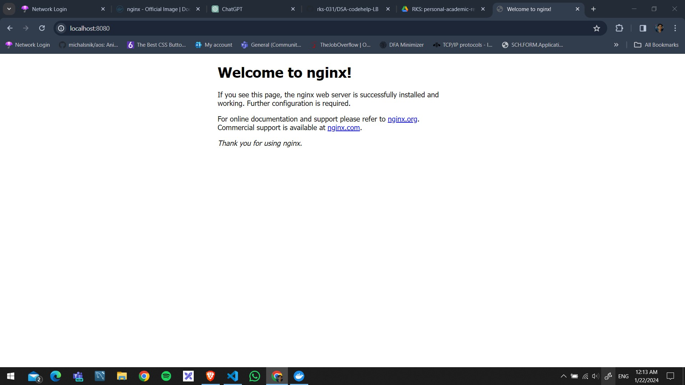

# pulling nginx image

docker pull nginx

# view the images

docker images

# running containers

docker run nginx: latest (this is in the format: docker run image_name: tag_name) {processes hang}

# list of all running containers

1. docker container ls
2. docker ps

# running container in detach mode

docker run -d nginx:latest

# stop container

docker stop container_id
or
docker stop vibrant_liskov

# exposing ports

docker run -d -p 8080:80 nginx:latest
{0.0.0.0:8080->80/tcp}  {Baiscally we are mapping the host port 8080 to container port 80} 
`Now open any browser and write localhost:8080 as the url` 

# exposing multiple ports

docker run -d -p 3000:80 -p 8080:80 nginx:latest

# managing containers

docker stop vibrant_liskov
  or  
docker start vibrant_liskov

# docker ps options

docker ps --help

#
