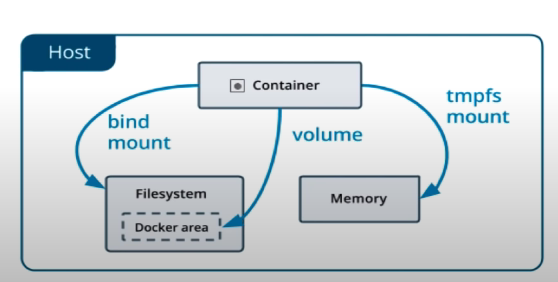
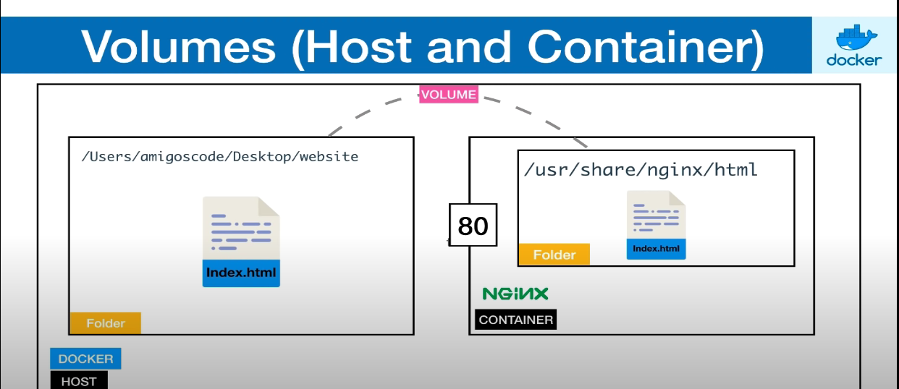

# pulling nginx image

docker pull nginx

# view the images

docker images

# running containers

docker run nginx: latest (this is in the format: docker run image_name: tag_name) {processes hang}

# list of all running containers

1. docker container ls
2. docker ps

# running container in detach mode

docker run -d nginx:latest

# stop container

docker stop container_id
or
docker stop vibrant_liskov

# exposing ports

docker run -d -p 8080:80 nginx:latest
{0.0.0.0:8080->80/tcp}  {Baiscally we are mapping the host port 8080 to container port 80} 
`Now open any browser and write localhost:8080 as the url` 

# exposing multiple ports

docker run -d -p 3000:80 -p 8080:80 nginx:latest

# managing containers

docker stop vibrant_liskov
  or  
docker start vibrant_liskov

# docker ps options

docker ps --help

# forcefully remove a container before stopping it

docker rm -f $(docker ps -aq)

# naming a container

docker run --name website -d -p 3000:80 -p 8080:80 nginx:latest

# formatting the way in which dtails of container should appear

docker ps --format="ID\t{{.ID}}\nNAME\t{{.Names}}\nIMAGE\t{{.Image}}\nPORTS\t{{.Ports}}\nCOMMAND\t{{.Command}}\nCREATED\t{{.CreatedAt}}\nSTATUS\t{{.Status}}\n"

# giving the format a name

$env:FORMAT = "ID\t{{.ID}}\nNAME\t{{.Names}}\nIMAGE\t{{.Image}}\nPORTS\t{{.Ports}}\nCOMMAND\t{{.Command}}\nCREATED\t{{.CreatedAt}}\nSTATUS\t{{.Status}}\n"
 
docker ps --format $env:FORMAT

# Volumes

Allows sharing of data. Files or Folders. 
Between Host and containers. 
Between containers.

# Volume Between Host and Container

cd `path to directory`  
docker run --name website -v $(pwd) -d -p 8080:80 nginx  
 
docker run --name website -v ${PWD}:/usr/share/nginx/html:ro -d -p 8080:80 nginx
 
`Format`: docker run --name some-nginx -v /some/content:/usr/share/nginx/html:ro -d nginx
<Remove the ro that stands for read only if you want to add some file to the dir>

# Execute the container in interactive mode

docker run --name website -v /some/content:/usr/share/nginx/html -d nginx  
docker exec -it website bash  
root@9b19f7d00015:/# cd /usr/share/nginx/html/ ....{This is just an exampe} 
